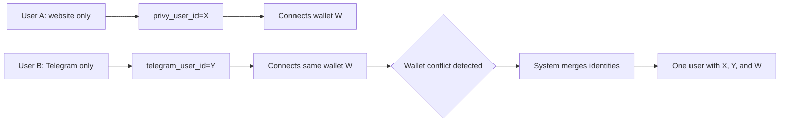

# Unified Identity System: Website ↔ Telegram

## Overview

HelpingHandsRewards.com implements a **unified identity system** where a single member can access their account from:
- **Website** (web browser)
- **Telegram Mini-App**

Both entry points connect to **the same user account**, with the same:
- Contribution Levels
- Matrix positions
- Rewards history
- Referral relationships

---

## CRITICAL: Wallet as Primary Identity

**HelpingHandsRewards.com is a blockchain-first, peer-to-peer system.**

### The Wallet Is The Only Real Membership Identity

**Core Principle**: Only `ton_wallet_address` is used to identify members for participation and Rewards.

- ✅ **Wallet address** = Membership identity (who you are on-chain)
- ✅ **Auth provider ID** (Privy) = Login identity (how you access from web)
- ✅ **Telegram user ID** = Login identity (how you access from Telegram)

### What This Means

1. **All matrices, cycles, and Recurring Rewards are keyed by `ton_wallet_address`**
   - Not by email
   - Not by full name
   - Not by street address
   - **Only by wallet**

2. **Email, name, and personal data are optional metadata**
   - They are **never** used as the primary key for:
     - Matrices
     - Rewards
     - Cycles
     - Contribution tracking
   - They exist only for display purposes (if provided at all)

3. **If a user has no wallet linked, they are not considered an "active member"**
   - They cannot participate in matrices
   - They cannot receive Rewards
   - They must connect a wallet to become a full member

### Identity Hierarchy

```
PRIMARY IDENTITY (Membership):
  ↓
ton_wallet_address ← All matrices, rewards, cycles tied to this
  ↓
SECONDARY IDENTITIES (Login methods):
  ├─ privy_user_id    (How wallet owner logs in from web)
  └─ telegram_user_id (How wallet owner logs in from Telegram)
  ↓
OPTIONAL METADATA (Display only):
  ├─ email
  ├─ fullName
  └─ country
```

### Conflict Resolution: Wallet Always Wins

When merging accounts, **the wallet-anchored account is always primary**:

```typescript
// Example: Two separate accounts try to link same wallet
Account A: privy_user_id + telegram_user_id (no wallet yet)
Account B: ton_wallet_address only

// Account B WINS because it has the wallet
// Result: privy_user_id and telegram_user_id copied to Account B
```

---

## Identity Anchors

Each user account can have **three identity anchors**:

```typescript
{
  // PRIMARY MEMBERSHIP IDENTITY
  ton_wallet_address: string // Blockchain membership (who you are)
  
  // LOGIN IDENTITIES (how you access your account)
  privy_user_id: string      // Auth provider (web login)
  telegram_user_id: string   // Telegram WebApp (Telegram login)
}
```

**All three can coexist in the same user row.**

**But only `ton_wallet_address` determines matrix participation and Rewards.**

---

## How Identity Resolution Works

### Priority Order

When a user authenticates, the system looks for existing accounts in this order:

1. **Primary**: `privy_user_id` (if auth token provided)
2. **Secondary**: `telegram_user_id` (if Telegram WebApp data provided)
3. **Tertiary**: `ton_wallet_address` (if wallet connected)

If any match is found, **the system merges identities** instead of creating duplicate accounts.

### Automatic Merging

The system automatically merges when:
- Same wallet connects from different entry points
- Same Telegram user connects with auth provider
- Same auth provider connects with Telegram

**Example**: User starts on website (gets `privy_user_id`), later opens Telegram mini-app (provides `telegram_user_id`). The system links both IDs to the same user row.

---

## Supported Flows

### Flow 1: Website First → Telegram Later


**Result**: One user with all three identity anchors

### Flow 2: Telegram First → Website Later


**Result**: One user with all three identity anchors

### Flow 3: Wallet-Based Merging



**Result**: Duplicate accounts merged into one

---

## Implementation Details

### AuthService.findOrCreateUserByProviderId()

Enhanced to support identity merging:

```typescript
// 1. Try to find by provider ID
let user = await this.db.query.users.findFirst({
  where: eq(users.privyUserId, providerId)
})

// 2. If not found, check if wallet exists
if (!user && metadata?.walletAddress) {
  const userByWallet = await this.db.query.users.findFirst({
    where: eq(users.tonWalletAddress, metadata.walletAddress)
  })
  
  if (userByWallet) {
    // Merge provider ID into existing wallet account
    await this.db.update(users)
      .set({ privyUserId: providerId })
      .where(eq(users.id, userByWallet.id))
  }
}

// 3. If not found, check if Telegram ID exists
if (!user && metadata?.telegramUserId) {
  const userByTelegram = await this.db.query.users.findFirst({
    where: eq(users.telegramUserId, metadata.telegramUserId)
  })
  
  if (userByTelegram) {
    // Merge provider ID into existing Telegram account
    await this.db.update(users)
      .set({ privyUserId: providerId })
      .where(eq(users.id, userByTelegram.id))
  }
}

// 4. Only create new user if no matches found
```

### TonService.linkWallet()

Enhanced to support wallet-based merging:

```typescript
// Check if wallet exists on different account
const existingUser = await this.db.query.users.findFirst({
  where: eq(users.tonWalletAddress, walletAddress)
})

if (existingUser && existingUser.id !== userId) {
  // MERGE STRATEGY: Determine which account to keep
  // Prefer account with more identity anchors
  // If equal, prefer older account (lower ID)
  
  const currentAnchors = countAnchors(currentUser)
  const existingAnchors = countAnchors(existingUser)
  
  let primaryUser, secondaryUser
  if (currentAnchors > existingAnchors) {
    primaryUser = currentUser
    secondaryUser = existingUser
  } else {
    primaryUser = existingUser
    secondaryUser = currentUser
  }
  
  // Merge missing identities into primary account
  await this.db.update(users)
    .set({
      privyUserId: primaryUser.privyUserId || secondaryUser.privyUserId,
      telegramUserId: primaryUser.telegramUserId || secondaryUser.telegramUserId
    })
    .where(eq(users.id, primaryUser.id))
  
  return { merged: true, mergedUserId: primaryUser.id }
}
```

### /api/auth/telegram-init

Telegram mini-app initialization with enhanced merging:

```typescript
// 1. Check if Telegram ID already exists
user = await authService.findUserByTelegramId(telegramData.userId)

// 2. If authToken provided, try to merge with provider account
if (!user && authToken) {
  const verifiedUser = await authProviderService.verifyAccessToken(authToken)
  
  user = await authService.findOrCreateUserByProviderId(verifiedUser.userId, {
    email: verifiedUser.email,
    walletAddress: verifiedUser.walletAddress,
    telegramUserId: telegramData.userId
  })
}

// 3. Only create new Telegram-only user if no matches
if (!user) {
  user = await db.insert(users).values({
    telegramUserId: telegramData.userId,
    fullName: `${telegramData.firstName} ${telegramData.lastName}`.trim(),
    // ...
  })
}
```

### /api/auth/verify-session

Website authentication with optional Telegram linking:

```typescript
// Verify auth provider token
const verifiedUser = await authProviderService.verifyAccessToken(authToken)

// Find or create (with automatic merging)
let user = await authService.findOrCreateUserByProviderId(verifiedUser.userId, {
  email: verifiedUser.email,
  walletAddress: verifiedUser.walletAddress,
  telegramUserId: telegramData?.userId // Optional
})

// Link Telegram if provided and not already linked
if (telegramData && !user.telegramUserId) {
  await authService.linkTelegramUser(user.id, telegramData.userId)
}
```

---

## Personal Data: Optional and Never Used for Rewards

### Email, Name, and Profile Fields

**IMPORTANT**: Email, full name, and any personal profile fields:

1. ✅ **Are NOT required to register or participate**
   - A user can create an account with just a wallet
   - No email needed
   - No full name needed
   - No KYC data (address, DOB, etc.)

2. ✅ **Are NEVER used as the primary key for**:
   - Matrix positioning
   - Reward distribution
   - Cycle completion
   - Contribution tracking
   - Any blockchain-related logic

3. ✅ **Are treated as optional profile fields only**:
   - For display purposes (if provided)
   - For user preference (optional)
   - For internal reference (optional)

### Peer-to-Peer, Wallet-Based System

This is a **peer-to-peer, wallet-based system**, not an email-based Web2 SaaS:

- ❌ **Not like**: Traditional web apps that require email/password
- ✅ **More like**: Uniswap, Aave, DeFi protocols (wallet-first)

**The wallet is the only identity that matters for participation.**

---

## Source of Truth

### Blockchain (TON Smart Contract)
**Source of truth for**:
- ✅ Contributions sent (on-chain transactions)
- ✅ Matrix positions (contract state)
- ✅ Cycles and re-entries (contract events)
- ✅ Auto-upgrades (contract logic)
- ✅ Rewards emitted (contract payouts)

### D1 Database (users table)
**Source of truth for**:
- ✅ Who this person is (identity mapping)
- ✅ Which login methods they use (web, Telegram, wallet)
- ✅ Referral relationships
- ✅ Profile information

### How They Work Together

```
User Action (Website or Telegram)
         ↓
  Authentication Layer
  (Login via privy_user_id OR telegram_user_id)
         ↓
    D1 Database
    (Resolves to user.id → ton_wallet_address)
         ↓
  WALLET IS THE KEY ← CRITICAL DECISION POINT
         ↓
  Blockchain Queries
  (Uses ton_wallet_address to read on-chain state)
         ↓
  Matrix Service
  (Uses userId, which represents the wallet owner)
         ↓
    Frontend Display
    (Shows unified data: wallet-based matrices + on-chain state)
```

**Key Point**: Even though the backend uses `userId` internally, that `userId` always represents **the owner of a specific wallet**. All matrix and reward logic is fundamentally wallet-based.

---

## Business Rules

### One Wallet = One User

**Rule**: A TON wallet can only be linked to **one user account**.

**Enforcement**:
- When wallet is linked to Account A
- If Account B tries to link same wallet
- System automatically merges A and B into one account

### Identity Merge Priority

When merging, the system keeps the account with:
1. **More identity anchors** (privy + telegram + wallet > privy + wallet)
2. **Older account** (if equal anchors, lower ID wins)

### No Duplicate Accounts

**Guarantee**: Same person cannot have multiple active accounts with same:
- `privy_user_id`
- `telegram_user_id`
- `ton_wallet_address`

Database constraints enforce uniqueness at schema level.

---

## Testing Scenarios

### Scenario 1: Website → Telegram (Same Person)

1. User registers on website → `privy_user_id = abc123`
2. User connects wallet → `ton_wallet_address = EQx...`
3. User opens Telegram mini-app → `telegram_user_id = 987654`
4. System finds user by `privy_user_id` OR `ton_wallet_address`
5. System links `telegram_user_id = 987654` to existing account
6. **Result**: One account with all three IDs

### Scenario 2: Telegram → Website (Same Person)

1. User opens Telegram mini-app → `telegram_user_id = 987654`
2. User connects wallet → `ton_wallet_address = EQx...`
3. User visits website and clicks "Continue" → `privy_user_id = abc123`
4. System finds user by `telegram_user_id` OR `ton_wallet_address`
5. System links `privy_user_id = abc123` to existing account
6. **Result**: One account with all three IDs

### Scenario 3: Two Separate Accounts → Wallet Merge

1. Account A: website only (`privy_user_id = abc123`)
2. Account B: Telegram only (`telegram_user_id = 987654`)
3. Account A connects wallet → `ton_wallet_address = EQx...`
4. Account B tries to connect same wallet
5. System detects conflict and merges:
   - Keeps Account A (website account)
   - Copies `telegram_user_id = 987654` to Account A
   - Marks Account B for deletion (TODO: implement)
6. **Result**: One merged account with all three IDs

---

## Future Enhancements

### Phase 1 (Current)
- ✅ Identity anchors in database
- ✅ Automatic linking when IDs match
- ✅ Wallet-based merging detection
- ⚠️ Basic merge (copies IDs only)

### Phase 2 (TODO)
- ⬜ Full account merge:
  - Migrate matrix instances
  - Migrate contributions
  - Migrate rewards
  - Delete secondary account
- ⬜ Telegram signature verification
- ⬜ Merge conflict UI (let user choose which account to keep)

### Phase 3 (TODO)
- ⬜ Account unlinking (disconnect Telegram from web account)
- ⬜ Multi-device support (same Telegram on multiple devices)
- ⬜ Admin dashboard for manual merges

---

## Security Considerations

### Telegram WebApp Verification

**Current**: Basic checks only (authDate, userId presence)

**TODO**: Implement full HMAC-SHA256 verification:
```typescript
// Verify Telegram WebApp initData signature
const checkString = Object.keys(initData)
  .filter(key => key !== 'hash')
  .sort()
  .map(key => `${key}=${initData[key]}`)
  .join('\n')

const secretKey = crypto.createHmac('sha256', 'WebAppData')
  .update(BOT_TOKEN)
  .digest()

const hash = crypto.createHmac('sha256', secretKey)
  .update(checkString)
  .digest('hex')

if (hash !== initData.hash) {
  throw new Error('Invalid Telegram signature')
}
```

### Auth Provider Token Verification

**Current**: Privy SDK handles verification

**Production**: Tokens are verified using Privy's server SDK with:
- RSA public key verification
- Token expiration checks
- Issuer validation

### Wallet Ownership

**Current**: Trust-based (user connects wallet via UI)

**Production**: Should implement proof-of-ownership:
1. Generate random challenge message
2. User signs message with private key
3. Server verifies signature matches wallet address

---

## API Endpoints Summary

### POST /api/auth/verify-session
**Purpose**: Website authentication
**Input**: `{ authToken, telegramData? }`
**Output**: `{ user, token }`
**Behavior**: Creates/finds user by provider ID, optionally links Telegram

### POST /api/auth/telegram-init
**Purpose**: Telegram mini-app initialization
**Input**: `{ telegramData, authToken? }`
**Output**: `{ user, token }`
**Behavior**: Creates/finds user by Telegram ID, optionally links provider

### POST /api/ton/link-wallet
**Purpose**: Connect TON wallet
**Input**: `{ walletAddress, network }`
**Output**: `{ merged: boolean, mergedUserId? }`
**Behavior**: Links wallet, merges accounts if wallet exists elsewhere

### GET /api/auth/me
**Purpose**: Get current user profile
**Input**: JWT token in Authorization header
**Output**: `{ user }`
**Behavior**: Returns unified profile with all linked identities

---

## Debugging Tips

### Check User's Linked Identities

```sql
SELECT 
  id,
  full_name,
  privy_user_id,
  telegram_user_id,
  ton_wallet_address,
  created_at
FROM users
WHERE 
  privy_user_id = 'abc123' OR
  telegram_user_id = '987654' OR
  ton_wallet_address = 'EQx...'
```

### Find Duplicate Accounts

```sql
-- Users with same wallet (should be 0 or 1)
SELECT ton_wallet_address, COUNT(*) as count
FROM users
WHERE ton_wallet_address IS NOT NULL
GROUP BY ton_wallet_address
HAVING count > 1

-- Users with same Telegram ID (should be 0 or 1)
SELECT telegram_user_id, COUNT(*) as count
FROM users
WHERE telegram_user_id IS NOT NULL
GROUP BY telegram_user_id
HAVING count > 1
```

### Trace Identity Resolution

Check server logs for these messages:
```
[Auth] Merged provider ID into Telegram user 123
[Auth] Linked Telegram ID to user 456
[Auth] Created new Telegram-only user 789
[TonService] Identity merge detected: User 999 merged into User 888
```

---

## Conclusion

The unified identity system ensures that:
- ✅ **Website and Telegram always show the same account**
- ✅ **One wallet = one logical user**
- ✅ **No duplicate accounts for the same person**
- ✅ **Seamless switching between web and Telegram**

The blockchain (TON smart contract) remains the source of truth for Contributions, Matrix positions, and Rewards. The D1 database maps identities (Privy, Telegram, wallet) to the same user, enabling unified access from any entry point.
